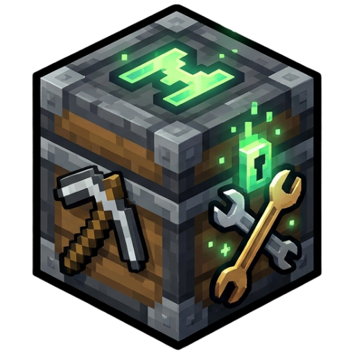
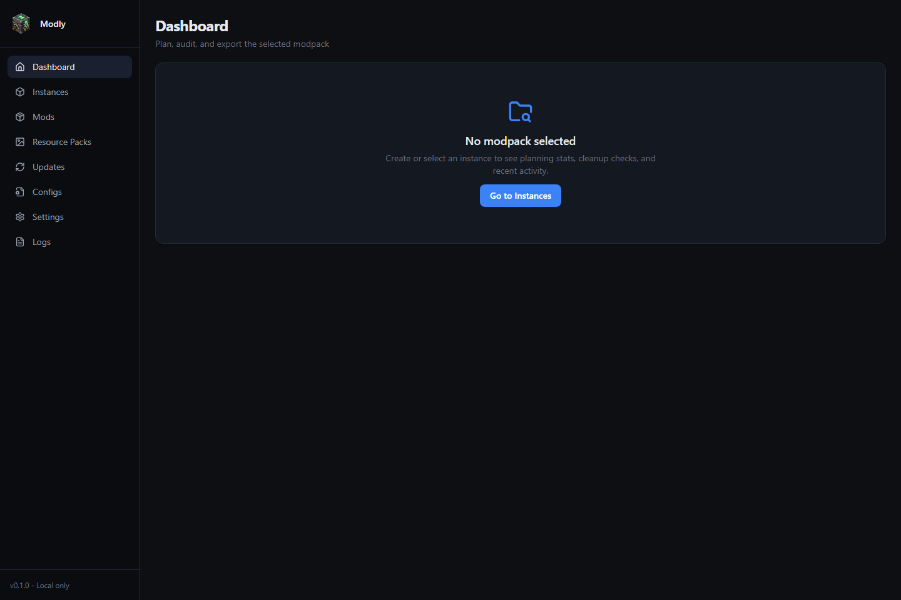
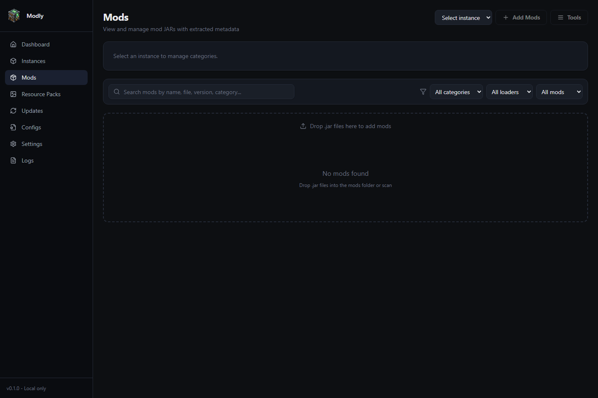
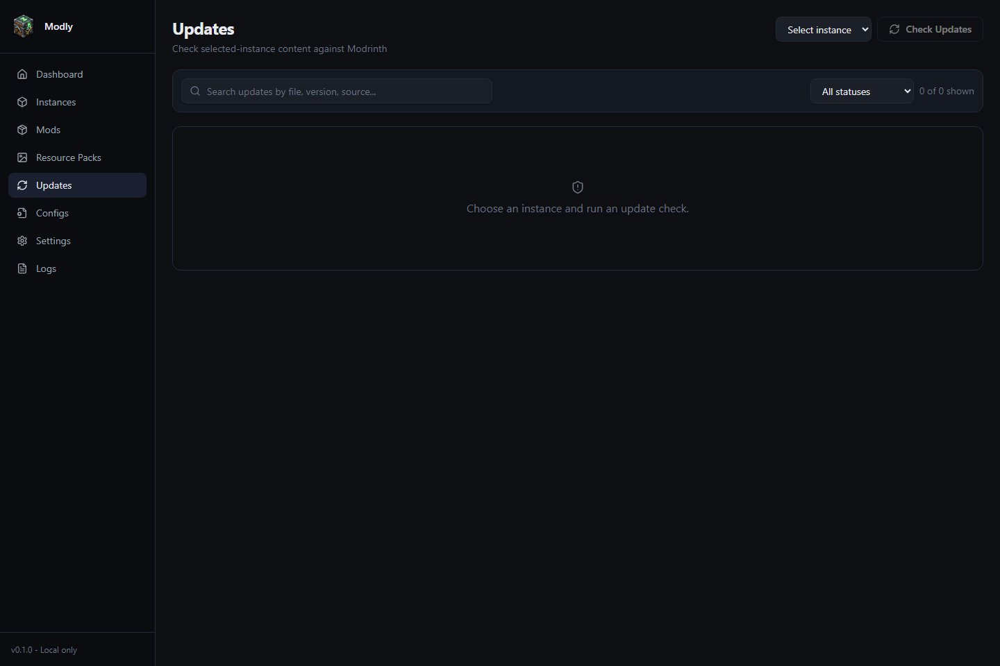
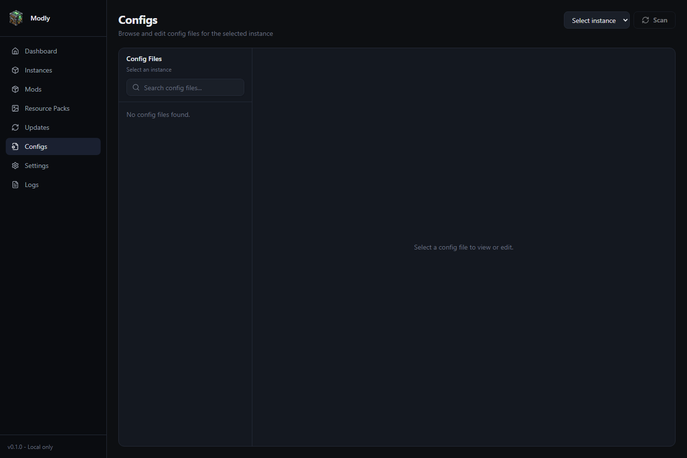

# Modly

  

  A cleaner way to manage Minecraft instances, sort your mods, catch problems early, and keep everything in one place without the usual folder chaos.

  
  
  
  

## Screenshots

<table>
  <tr>
    <td width="50%">
      <strong>Dashboard</strong> 
      
    </td>
    <td width="50%">
      <strong>Mods</strong> 
      
    </td>
  </tr>
  <tr>
    <td width="50%">
      <strong>Updates</strong> 
      
    </td>
    <td width="50%">
      <strong>Configs</strong> 
      
    </td>
  </tr>
</table>

## Highlights

- Create, duplicate, import, export, and organize Minecraft instances your way.
- Sort installed mods faster, tag them, and filter what matters in seconds.
- Save mod ideas as suggestions, preview their source pages, and turn them into installed mods when you're ready.
- Check for compatible updates and install them with less guesswork.
- Catch broken or missing mod files before they ruin a play session.
- Manage resource packs, shader packs, and configs alongside each instance.
- Keep a simple local activity trail so it is easier to see what changed.

## Install

Grab the latest `.msi` from the [GitHub Releases](../../releases) page, run it, and launch **Modly**.

## Local Data

Modly keeps its settings and managed details on your device. Your Minecraft files stay in the instance folders you choose.
