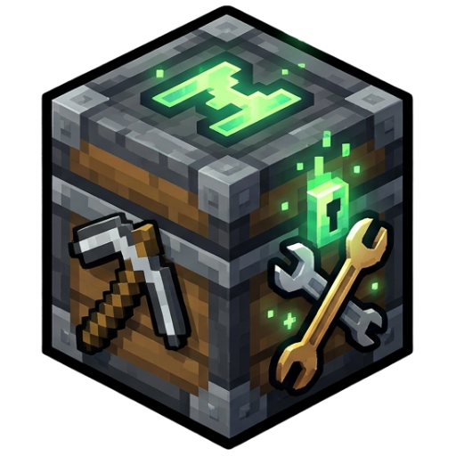

# Modly

<p align="center">
  
</p>

<p align="center">
  A desktop modpack manager for understanding, maintaining, and improving Minecraft packs in the folders you already use.
</p>

<p align="center">
  
  
  
  
</p>

Modly manages pack contents and metadata. It does not launch Minecraft or manage game accounts or Java runtimes. See [the product boundary](docs/PRODUCT.md).

## Highlights

- Create, duplicate, import, export, and organize Minecraft instances your way.
- Sort installed mods faster, tag them, and filter what matters in seconds.
- Explore a graph-first Relationships workspace powered by Cytoscape.js with pan, zoom, fit-to-view, search focus, and isolated-mod filtering.
- Inspect declared dependencies and manual dependency or add-on links in the Relationships workspace.
- Click any mod in the graph to edit its outgoing relationships in a lightweight table modal with add, save, and bulk-delete flows.
- Save mod ideas as suggestions, preview their source pages, and turn them into installed mods when you're ready.
- Use Modpack Scout to read installed JAR metadata from a managed instance or a selected local folder without changing the pack.
- Check for compatible updates and install them with less guesswork.
- Catch broken or missing mod files before they ruin a play session.
- Manage DSR packs across resource packs, shader packs, and datapacks for each instance.
- Override per-instance resource pack, shader pack, datapack, and config paths when a pack uses a non-default folder layout.
- Delete instance categories safely by clearing affected mods or bulk-moving them into a replacement category.
- Keep a simple local activity trail so it is easier to see what changed.

## Install

Grab the latest `.msi` from the [GitHub Releases](../../releases) page, run it, and launch **Modly**.

## Local Data

Modly keeps its settings and managed details on your device. Your Minecraft files stay in the instance folders you choose.

## Modpack Scout

Modpack Scout is a read-only Modly module for inspecting a modpack and finding additions that fit it. Choose an existing Modly instance or browse to a Minecraft root (or its `mods` directory), then select **Analyze Pack**.

The initial scanner reads `META-INF/neoforge.mods.toml`, `META-INF/mods.toml`, `fabric.mod.json`, and legacy `mcmod.info` files inside mod JARs. It records installed mod IDs, names, versions, loaders, and declared dependencies in Modly's local SQLite database. Malformed JARs are reported without stopping the scan.

Scout never writes to the selected pack's `mods`, `config`, `saves`, or `worlds` folders. Its recommendation search uses Modrinth's official API and requires a feature or theme query. Results are restricted to the detected Minecraft version and loader, exclude obvious installed matches, and are cached locally for six hours. Scout ranks them with an explainable score for theme fit, search-goal fit, installed ecosystem references, maintenance, category overlap, and basic performance risk. Candidate dependency and conflict checks are not implemented yet and are shown as unevaluated rather than inferred.

## Development

Run the desktop app locally with:

```bash
npm install
npm run tauri dev
```
